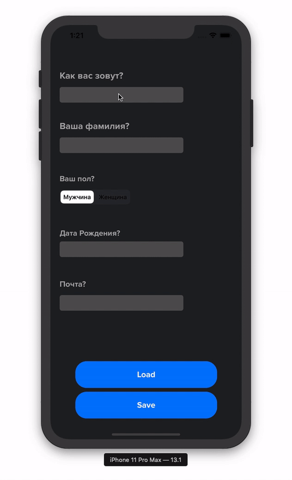
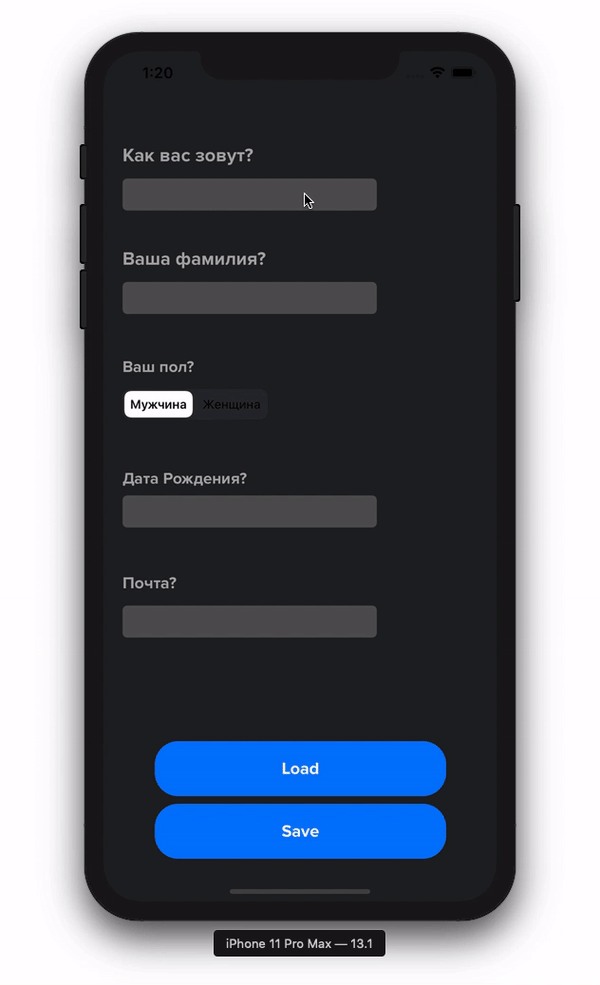
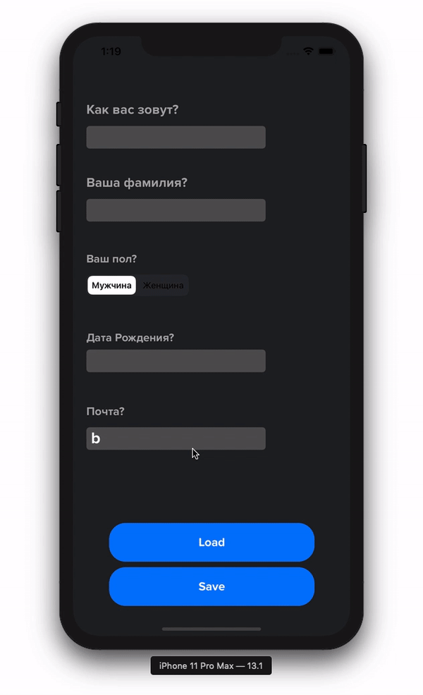
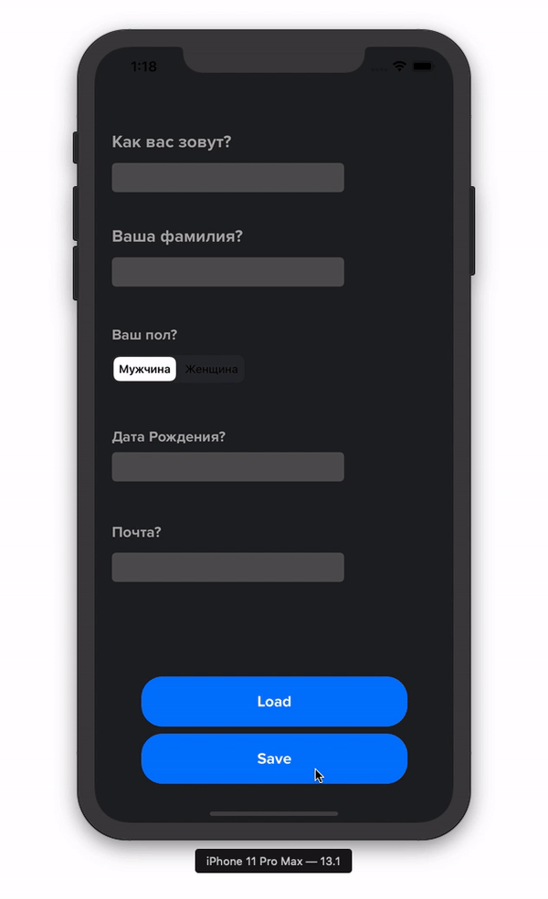
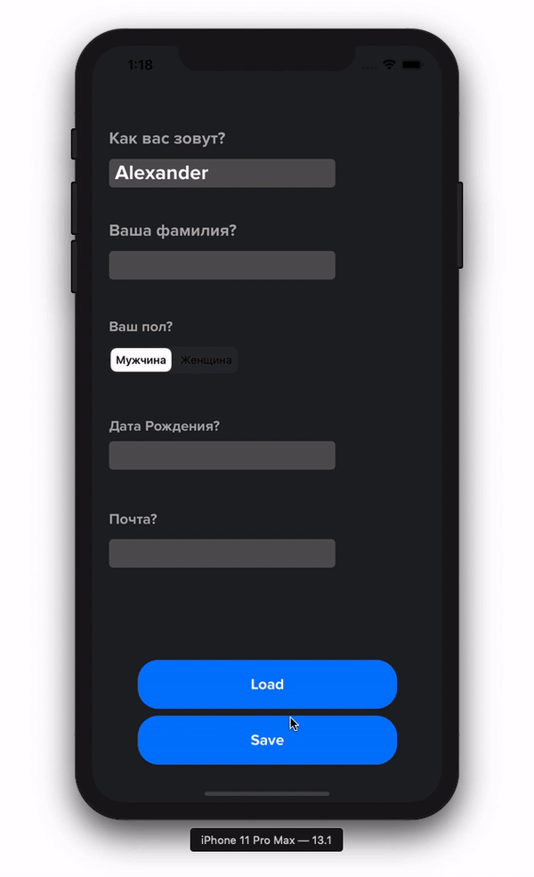

# Registration_Form_Swift
Базовая форма регистрации

***Базовая форма регистрации с сохранением в CoreData и ее последующая выгрузка***
***Поле 1*** - Имя
***Поле 2*** - Фамилия
***Поле 3*** - Пол
***Поле 4*** - Дата рождения
***Поле 5*** - Почта

***Save*** - Сохранение данных
***Load*** - Получение данных

***Базовая валидация***

Если мы начали редактировать поле, но потом все стерли, то оно начнет двигаться с помощью CoreAnimation, привлекая внимание на ошибку ввода. 

Также применяется смещение view, при появлениии клавиатуры, если оно имеет место быть. 

Валидация email-адреса. 

***Сохранение данных***

При нажатии на кнопку Save происходит проверка всех заполненных параметров, если каких-то данных нет, то это поле подсвечивается. 

Если все данные корректные, то происходит сохранение в хранилище. 

***Выгрузка данных***

При нажатии на кнопку Load происходит переход на другой экран, где появляются последние сохраненные данные. 

Также можно удалить все данные, которые находятся в хранилище

Если данных в хранилище нет, то появляется Alert
